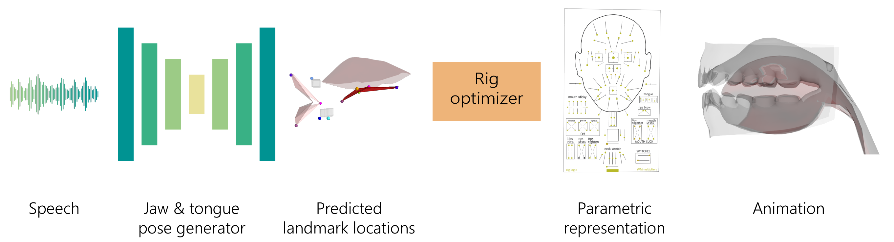

# Speech Driven Tongue Animation



> Advances in speech driven animation techniques now allow creating convincing animations of virtual characters solely from audio data. While many approaches focus on facial and lip motion, they often do not provide realistic animation of the inner mouth. Performance or motion capture of the tongue and jaw from video alone is difficult because the inner mouth is only partially observable during speech. In this work, we collected a large-scale speech to tongue mocap dataset that focuses on capturing tongue, jaw, and lip motion during speech. This dataset enables research on data-driven techniques for realistic inner mouth animation. We present a method that leverages recent deep-learning based audio feature representations to build a robust and generalizable speech to animation pipeline. We find that self-supervised deep learning based audio feature encoders are robust and generalize well to unseen speakers and content.

**Links**: [\[Project\]](https://salmedina.github.io/tongue-anim) | [\[Paper\]]() | [\[Video\]]() | [\[Data\]](https://drive.google.com/file/d/1AkbLsj41ftc56HNPWAI-Y26-QK4Bqbo9/view?usp=sharing)

## Data

The data can be downloaded from this [link](https://drive.google.com/file/d/1AkbLsj41ftc56HNPWAI-Y26-QK4Bqbo9/view?usp=sharing). The dataset includes:
- Mono audio in `wav` format with a sample rate of 16 kHz
- EMA 3D landmark sequences @ 50 FPS
- Audio transcripts

## Installation

### Conda Environment

Create the conda environment from the yaml file `envs/tongueanim.yaml`
```
conda create -f envs/tongueanim.yaml
```

### Wav2Vec

Our best model uses Wav2Vec audio features. For this you need to [download the model](https://dl.fbaipublicfiles.com/fairseq/wav2vec/wav2vec_large.pt) from the [Fairseq repository](https://github.com/pytorch/fairseq/blob/main/examples/wav2vec/README.md) and place it under the `models/` folder.

## Pipeline

Our pipeline consists of the following stage:
1. Extract audio features from wav2vec model
2. Build the dataset to train the model
3. Train the landmark prediction model
4. Evaluate the model
5. Visualize the model

### 1. Audio Feature Extraction

### 2. Building the dataset

### 3. Training the model

### 4. Testing the model

### 5. Visualizing the results

## Citation

If you find this work useful on your research, please cite our work:
```
@inproceedings{medina2022speechtongue,
  title={Speech Driven Tongue Animation},
  author={Medina, Salvador and Tomé, Denis and Stoll, Carsten and Tiede, Mark and Munhall, Kevin and Hauptmann, Alex and Matthews, Iain},
  booktitle={Proceedings of the IEEE/CVF Conference on Computer Vision and Pattern Recognition (CVPR)},
  year={2022},
  organization={IEEE/CVF}
}
```
## License

Our code is released under MIT License.
